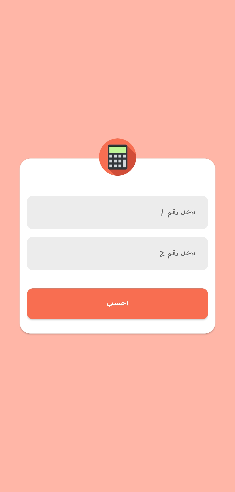
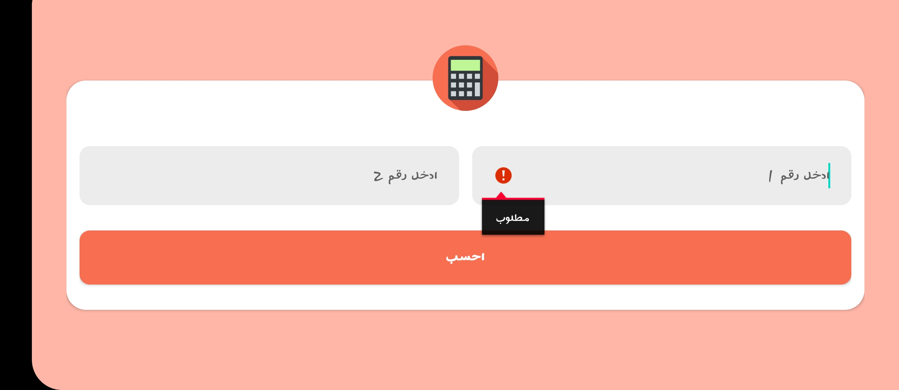
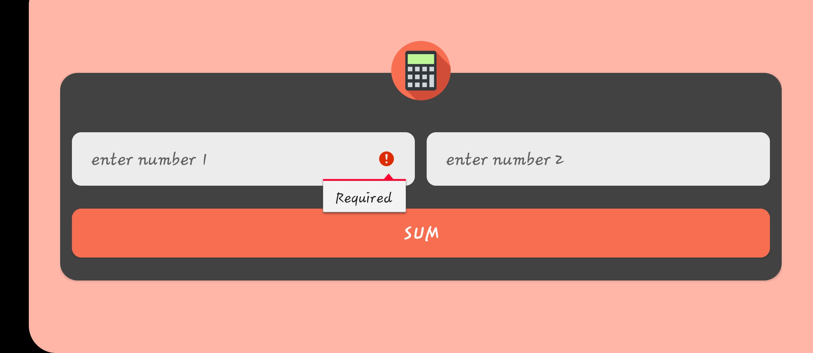

# Calculator App
A very basic calculator application created with Kotlin Android Studio. 

### Screenshots
Arabic / light / Portrait |  English / Dark / Portrait
:-----------------------:|:---------------------------
 | 
Arabic / light / Landscape|English / Dark / Landscape
 | 

### Requirements 🔧
* Android studio & kotlin extension

### Installation 🔌
1. Press the **Fork** button (top right the page) to save copy of this project on your account.

2. Download the repository files (project) from the download section or clone this project by typing in the bash the following command:

       git clone https://github.com/mina0maher/calculator.git
3. Imported it in Android studio.
4. Run the application :D

### Contributing 💡
If you want to contribute to this project and make it better with new ideas, your pull request is very welcomed.
If you find any issue just put it in the repository issue section, thank you.
